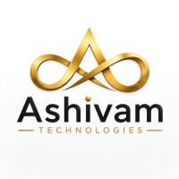

# Ashivam Technologies - Premium Software Solutions



Welcome to the official repository for **Ashivam Technologies**, a cutting-edge corporate website showcasing premium software solutions, web development, mobile apps, and AI technologies. Built with performance, aesthetics, and modern web standards in mind.

## ?? Live Preview
*(Add your live Vercel/Netlify link here once deployed)*

## ? Key Features
- **Premium Design System:** Beautiful glassmorphism UI, gradient typography, and a tailored white/gold/blue color palette for an ultra-premium feel.
- **Dynamic Backgrounds:** Features a seamless, subtle digital globe video background acting as an elegant watermark across all pages.
- **Interactive 3D Elements:** Integrates Three.js for a stunning, interactive particle globe hero section.
- **Smooth Animations:** Powered by `framer-motion`, featuring staggered fade-ins and viewport-triggered animations on every scroll.
- **Fully Responsive:** Flawless mobile-first design using modern CSS Grid and Flexbox techniques.
- **SEO Optimized:** Next.js Server-Side Rendering (SSR) and Metadata API implemented for maximum search engine visibility.

## ??? Tech Stack
- **Framework:** [Next.js 15](https://nextjs.org/) (App Router)
- **Library:** [React 19](https://react.dev/)
- **Language:** [TypeScript](https://www.typescriptlang.org/)
- **Styling:** Vanilla CSS (Global & CSS Modules) with CSS Variables for easy theming
- **Animations:** [Framer Motion](https://www.framer.com/motion/)
- **3D Graphics:** [Three.js](https://threejs.org/)
- **Icons:** [Lucide React](https://lucide.dev/)

## ?? Project Structure
```text
src/
+-- app/                  # Next.js App Router (Pages, Layouts, Globals)
¦   +-- about/            # About Us Page
¦   +-- careers/          # Careers Page
¦   +-- contact/          # Contact Page
¦   +-- portfolio/        # Portfolio Page
¦   +-- services/         # Services Page
¦   +-- solutions/        # Solutions Page
¦   +-- globals.css       # Global design tokens, styling, utilities
¦   +-- layout.tsx        # Root layout with global video background
¦   +-- page.tsx          # Landing Page / Hero Section
+-- components/           # Reusable UI Components
¦   +-- Navbar.tsx        # Main navigation header
¦   +-- Footer.tsx        # Global footer
¦   +-- ThreeBackground.tsx # 3D interactive globe component
public/                   # Static assets (Images, Videos, SVGs)
```

## ?? Local Development Setup

To run this project locally on your machine, follow these steps:

**1. Clone the repository**
```bash
git clone https://github.com/AshivamTechnologies/ashivam-tech-main.git
cd ashivam-tech-main
```

**2. Install dependencies**
```bash
npm install
# or
yarn install
```

**3. Run the development server**
```bash
npm run dev
```

**4. Open the application**
Navigate to [http://localhost:3000](http://localhost:3000) in your browser to see the result.

## ?? Customization
- **Colors & Fonts:** Modify the CSS variables inside `:root` in `src/app/globals.css`.
- **Background Video:** Replace `public/bg-video.mp4` with any other MP4 file to instantly change the global site texture.

## ?? License
© 2026 Ashivam Technologies. All rights reserved.
